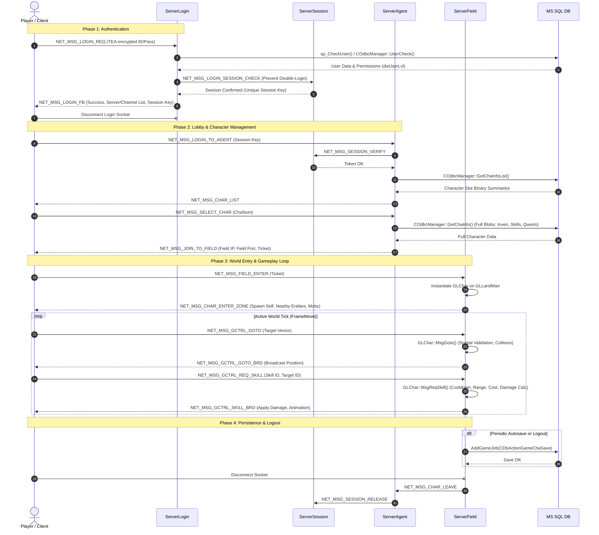

# System Architecture

## Distributed Multi-Server Topology

RanOnline MMO employs a distributed multi-process server architecture designed to scale across multiple CPU cores and network nodes.

```mermaid
flowchart TD
    Client["GameClient2 / GameEmulator (DirectX 9)"]

    subgraph Cluster ["Server Cluster"]
        Login["ServerLogin (Port: 5001)\n- User Authentication\n- Version Verification\n- Server/Channel Discovery"]
        Session["ServerSession (Port: 5002)\n- Cluster State Coordinator\n- Single-Login Verification\n- Server Heartbeat Sync"]
        Agent["ServerAgent (Port: 5101+)\n- Character Selection & Lobby\n- Party & Guild (Club) Bus\n- Global & Whisper Chat\n- Field Handoff Gateway"]
        Field1["ServerField (Channel 1, Field 1)\n- Zone Map Ticking (GLGaeaServer)\n- Combat, Skills, Collision\n- Inventory, Trades, NPC/Mob AI"]
        Field2["ServerField (Channel 1, Field 2)\n- Additional Maps / Dungeons\n- Instance PvP (Tyranny, SW, CTF)"]
    end

    subgraph Database ["Persistence Layer (ODBC / MSSQL)"]
        DB_User[("RanUser Database\n- UserInfo / Accounts\n- Passwords / Bans")]
        DB_Game[("RanGame Database\n- ChaInfo / Stats / Level\n- ChaInven / Skills\n- Guild / Pet / Vehicle")]
        DB_Log[("RanLog Database\n- Action Logs\n- Economy / Trade Logs")]
        DB_Shop[("RanShop Database\n- Web Item Shop")]
    end

    Client -->|1. Auth Request| Login
    Login -->|ODBC Auth Query| DB_User
    Login -->|2. Verify Session Ticket| Session
    Login -->|3. Return Server List| Client

    Client -->|4. Connect to Agent| Agent
    Agent <-->|IPC Sync & Status| Session
    Agent -->|ODBC Load Char List| DB_Game

    Client -->|5. Connect to Field (Zone)| Field1
    Client -.->|Zone Transfer| Field2
    Field1 <-->|Field Status & Handoff| Agent
    Field2 <-->|Field Status & Handoff| Agent
    Field1 <-->|IPC Heartbeat| Session
    Field2 <-->|IPC Heartbeat| Session

    Field1 -->|Async DbAction Queue| DB_Game
    Field1 -->|Async DbAction Queue| DB_Log
```

---

## Session Lifecycle State Machine



---

## Threading Model

1. **Network I/O Thread Pool (IOCP)**:
   - Managed in `s_CServer.cpp:115` (`WorkerThread`).
   - Uses `CreateIoCompletionPort` and `GetQueuedCompletionStatus` for concurrent packet reads/writes without per-connection threads.
2. **Main Engine Tick Loop**:
   - `GLGaeaServer::FrameMove` (Field Server) and `GLAgentServer::FrameMove` (Agent Server).
   - Runs deterministic game simulation cycles (NPC AI updates, mob spawning schedules, buff decays, PvP state progression).
3. **Asynchronous Database Worker Pool**:
   - Managed in `s_CDbAction.cpp:80` (`CDbActionQueue` / `DbActionThread`).
   - Offloads slow disk I/O and stored procedures (`sp_SaveChaInfo`, logging) to background worker threads, preventing latency spikes on the game tick.
