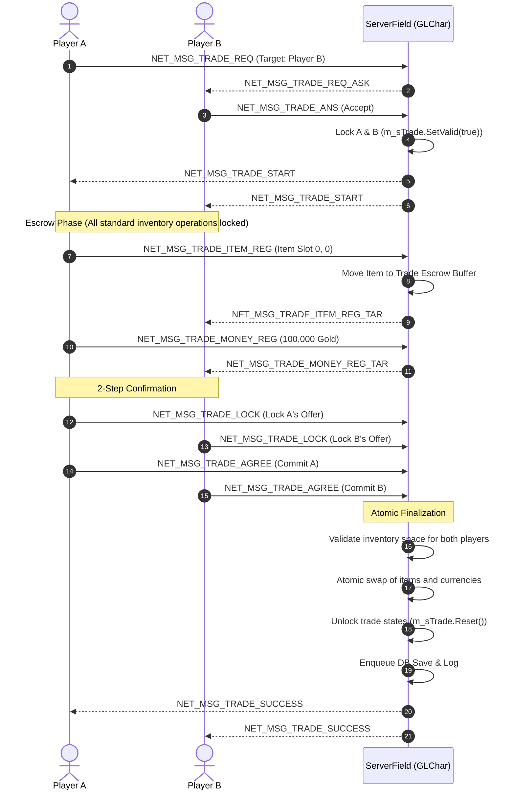

# Subsystem: Economy, Inventory & Trade Systems

## Purpose
The Economy subsystem oversees inventory transactions, item generation, secure player-to-player trading, NPC merchant shops, bank storage locks, and persistent currency reconciliation.

---

## Key Files & Classes

| File | Component / Class | Responsibility |
| :--- | :--- | :--- |
| `Lib_Client/G-Logic/GLInventory.h/.cpp` | `GLInventory` | 2D slot grid, item placement, stack splitting, capacity checks. |
| `Lib_Client/G-Logic/GLItem.h/.cpp` | `GLItem` / `GLItemMan` | Item prototype definitions, stats, durability, instance properties. |
| `Lib_Client/G-Logic/GLTrade.h/.cpp` | `GLTrade` | Server-side 2-party trade escrow state machine and lock flags. |
| `Lib_Client/G-Logic/GLTradeClient.h/.cpp` | `GLTradeClient` | Client-side trade window and UI state sync. |
| `Lib_Client/G-Logic/GLCharInvenMsg.cpp` | `GLChar` Inven Handlers | Inventory mutation packets (`MsgReqInvenToHold`, `MsgReqInvenSplit`). |
| `Lib_Client/G-Logic/GLCharStorageMsg.cpp` | `GLChar` Storage Handlers | Account bank storage transactions (`MsgReqStorageToHold`). |
| `Lib_Client/G-Logic/GLPrivateMarket.h/.cpp` | `GLPrivateMarket` | Player vending store escrow and buy/sell operations. |
| `Lib_Network/s_COdbcGameInven.cpp` | `COdbcManager::SaveChaInven` | Serializes inventory slot binary structures to database. |

---

## Trade Lifecycle & Duplication Prevention

---

## Anti-Duplication Hardening Rules

1. **State Isolation**: When `m_sTrade.Valid() == true`, all standard inventory manipulation packets (`MsgReqInvenToHold`, `MsgReqInvenSplit`, `MsgReqInvenToSlot`, `MsgReqHoldToField`) are rejected with `S_FALSE` (`GLCharInvenMsg.cpp:1615`, `GLCharInvenMsg.cpp:3100`).
2. **Transaction Atomicity**: If either client disconnects or fails inventory capacity validation during trade completion, all items are restored from escrow buffers to their original owners.
3. **Database Blob Checksums**: Persistent inventory items (`ChaInven`, `ChaPutOnItems`) are saved as contiguous validated binary streams with unique `lnGenNum` serial IDs to detect cloned items.
